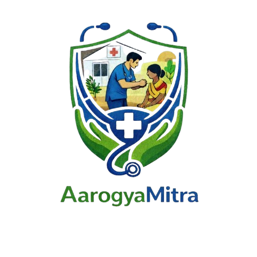
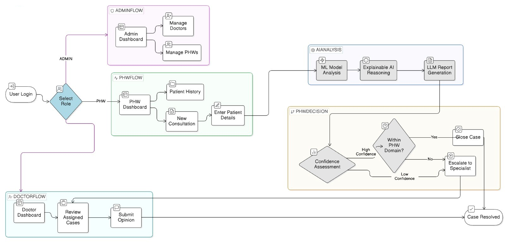

<p align="center">
  
</p>

# 🏥 ArogyaMitra — AI-Powered Primary Healthcare Decision Support System
**End-to-End Clinical Intelligence System for Disease Prediction, Explainable AI & Specialist Escalation**

## 📌 Overview  
**ArogyaMitra** is a diagnostic empowerment platform built for primary healthcare workers in underserved regions. Traditionally, frontline workers face challenges in accurate diagnosis and timely referral. ArogyaMitra solves this by combining Machine Learning precision with Explainable AI (LIME) and LLM-powered clinical interpretations to provide reliable decision support at the point of care.

---

## 🎯 Problem Statement  
Frontline healthcare workers often serve as the first point of contact in rural areas but may lack the specialized training needed for complex diagnosis. Manual symptom analysis is prone to error, and diagnostic reports often lack the transparency needed for clinical trust. **ArogyaMitra** automates the prediction pipeline while providing clear, evidence-backed explanations for every clinical suggestion.

---

## 🎯 Goal  
Build a robust healthcare ecosystem where the **ArogyaMitra Core System** orchestrates specialized ML and LLM modules to perform automated disease assessment, generate multilingual reports, and manage specialist consultations through a secure, role-based dashboard.

---

## 🏗️ System Flow
<p align="center">
  
</p>

---

## ✨ Key Features

### 🔹 1. Intelligent Disease Prediction
- Classifies 40+ common and critical diseases using a **Random Forest Classifier**.
- Achieves high accuracy by processing multi-dimensional symptom clusters.
- Provides a "Severity Score" (1-7) for immediate triage prioritization.

### 🔹 2. Explainable AI (LIME Integration)
- Breaks the "Black Box" of AI by showing exactly which symptoms influenced the diagnosis.
- Displays impact scores (Supports vs. Against) for every symptom reported.
- Builds clinical trust through transparency and evidence-based reasoning.

### 🔹 3. LLM-Powered Clinical Insights
- Uses **Google Gemini API** via a LangGraph pipeline to generate natural language summaries.
- Provides interpreted next steps, referral recommendations, and precautions.
- Contextualizes raw ML scores into actionable clinical advice.

### 🔹 4. Multilingual Report Generation
- Instantly generates professional PDF reports using **ReportLab**.
- Native support for **English, Hindi, Marathi, etc.** to serve diverse patient populations.
- Includes data visualizations of symptom impact and severity mapping.

### 🔹 5. Role-Based Data Silos
- **Admin**: Manages user ecosystems and monitors regional health trends.
- **Worker**: Registers patients and conducts the primary AI-assisted analysis.
- **Doctor**: Reviews escalated cases for expert second opinions and validation.

---

## 🧠 Core System Architecture

### **1. Master Orchestration Module**
```yaml
Purpose: Coordinate the flow from symptom input to final report
Tools:
  - 🧩 Node.js/Express (System Core)
  - 🔐 JWT (Role-Based Access)
  - 🔄 LangGraph (Workflow Orchestration)
Output:
  - Unified Dashboard Experience
  - Case Escalation Workflow
  - Secure Patient Records
```

### **2. Clinical ML Module**
```yaml
Purpose: High-precision disease classification
Tools:
  - 🌲 Random Forest Algorithm (Scikit-Learn)
  - 🔬 LIME (Explainable AI Engine)
  - ⚡ FastAPI (ML Service Layer)
Output:
  - Disease Probabilities
  - Feature Importance Scores
  - Severity Assessments
```

### **3. Medical Insight Module (LLM)**
```yaml
Purpose: Interpret raw data into clinical narratives
Tools:
  - 💎 Google Gemini API
  - 🧠 LangGraph (Reasoning Pipeline)
  - 📄 ReportLab (PDF Synthesis)
Output:
  - Diagnosis Summaries
  - Precise Precautions
  - Referral Recommendations
```

---

## 🛠️ Tech Stack

<table align="center">
<tr>
<th>Category</th>
<th>Technology</th>
<th>Purpose</th>
</tr>

<!-- Frontend Section -->
<tr>
<td rowspan="3">🎨 <strong>Frontend</strong></td>
<td></td>
<td>Responsive Dashboard UI</td>
</tr>

<tr>
<td></td>
<td>Modern Frontend Tooling</td>
</tr>

<tr>
<td></td>
<td>Premium Aesthetic Styling</td>
</tr>

<!-- Backend Section -->
<tr>
<td rowspan="2">⚡ <strong>Backend</strong></td>
<td></td>
<td>Primary API & Business Logic</td>
</tr>

<tr>
<td></td>
<td>Middleware & Routing</td>
</tr>

<!-- ML & AI Section -->
<tr>
<td rowspan="3">🤖 <strong>ML & AI</strong></td>
<td></td>
<td>ML Model Deployment</td>
</tr>

<tr>
<td></td>
<td>Medical Interpretation (LLM)</td>
</tr>

<tr>
<td></td>
<td>AI Workflow Orchestration</td>
</tr>

<!-- Database Section -->
<tr>
<td rowspan="1">💾 <strong>Database</strong></td>
<td></td>
<td>Patient & User Data Storage</td>
</tr>

</table>

---

# 📚 Installation & Setup

### 1. Clone & Navigate
```bash
git clone https://github.com/Ayush-div/ArogyaMitra.git
cd ArogyaMitra
```

### 2. Setup Python Environment

**macOS/Linux:**
```bash
python3 -m venv .venv
source .venv/bin/activate
```

**Windows (PowerShell):**
```powershell
python -m venv .venv
.venv\Scripts\Activate.ps1
```

### 3. Initialize Backend
```bash
cd backend
npm install
# Copy .env.example to .env and fill in your keys:
# DB_URL, JWT_SECRET, OTPEMAIL, OTPPASSWORD
cp .env.example .env 
npm run dev
```

### 4. Initialize Frontend
```bash
cd ../Frontend
npm install
# Create .env and add your base URLs
npm run dev
```

### 5. ML Service Setup
```bash
cd ../ML_Model
pip install -r requirements.txt
python server.py
```

---

## 📊 Dataset & Deployment
- **Dataset**: [Kaggle Disease-Symptom Dataset](https://www.kaggle.com/datasets/kaushil268/disease-prediction-using-machine-learning)
- **Deployed Model**: [Hugging Face Space API](https://dashayush-arogyamitra-api.hf.space)

## 🎬 How It Works
1. **Intake**: Worker enters patient symptoms into the React dashboard.
2. **Analysis**: The FastAPI ML module runs a Random Forest check and LIME explanation.
3. **Interpretation**: The LangGraph module uses Gemini to explain the findings in plain language.
4. **Reporting**: ReportLab synthesizes a multilingual PDF for the patient.
5. **Review**: Complex cases are flagged for Doctor review via the secure portal.

---
<p align="center"><b>Built by Ayush-div • Empowering Frontline Healthcare</b></p>
